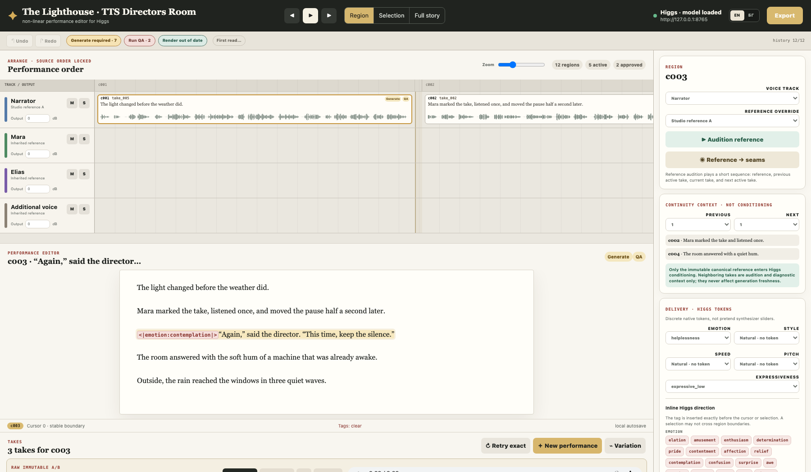
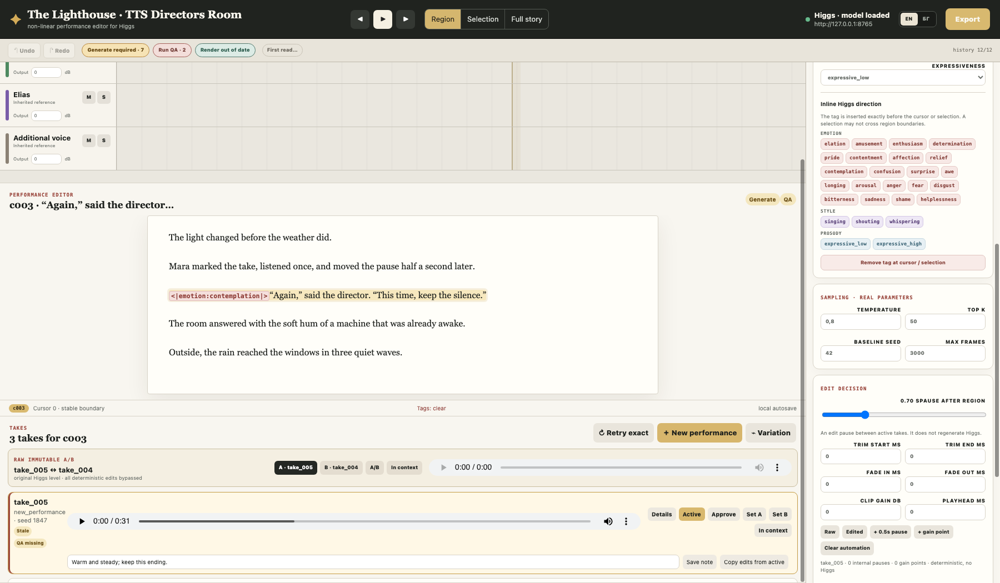
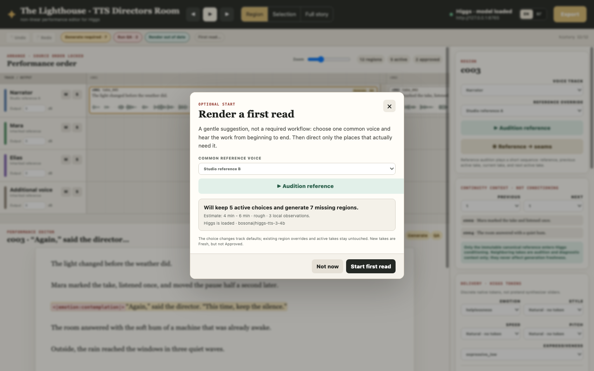

# TTS Directors Room

<p align="center">
  
</p>

<p align="center">
  
</p>

<p align="center">
  
</p>

Три реални изгледа на приложението: подредба на говорителите и текста,
избор и обработка на тейкове, и незадължителният първи прочит. Screenshot-ите
ползват измислен demo ръкопис. Няма публикуван частен текст или референтен глас.

> Аудиокнига се режисира. Не се получава с достатъчно настойчиво натискане на
> Generate и надежда, че седемнайсетият seed ще разбере намека.

TTS Directors Room е локален non-linear performance editor за
[Higgs TTS 3](https://github.com/boson-ai/higgs-audio). Ръкописът е source of
truth. Всеки регион може да има много immutable takes, един активен take,
независима човешка оценка и non-destructive audio edits.

Не е универсална TTS абстракция и не се преструва на DAW. Higgs е конкретният
двигател, а интерфейсът пази конкретната му generation transaction: текст,
каноничен референтен глас, delivery tokens, sampling parameters, seed,
endpoint/model/build наблюдение и output hash.

Интерфейсът е на английски при първо отваряне. Българският е на един клик и
изборът се запазва локално.

---

## Как се мисли за аудиото

```text
Generate -> Audition -> Activate -> Render -> Export
```

- **Generate** създава нов immutable take. Не го активира автоматично.
- **Audition** позволява raw A/B, edited и context преслушване.
- **Activate** избира изпълнението за edit decision list-а.
- **Approve** означава „чух го и го приемам“. Това е независимо от Fresh.
- **Render** сглобява активния EDL с trims, fades, gain, automation и паузи.
  Не вика Higgs.
- **Export** създава immutable WAV/MP3/manifest revision от готов render.

`Retry exact`, `New performance` и `Variation` са различни операции. Първата
пази точния request и seed, втората пази режисурата с нов seed, а третата записва
малка промяна на реални sampling параметри.

Най-важната граница е проста: при генерация Higgs получава само избрания
каноничен voice reference. Съседните генерирани тейкове са audition context, не
conditioning audio. Иначе гласът постепенно дрейфва, докато няколко региона
по-късно не започне да озвучава съвсем друга книга.

## Какво вече работи

- source-locked timeline с вертикално подравнени speaker channel strips и
  waveform lanes;
- editable manuscript с inline Higgs emotion, style и prosody tokens;
- истински waveform, playhead и zoom;
- take-owned trim, fade-in/out, clip gain, volume envelope и вътрешни паузи;
- boundary pause между региони и track output gain;
- raw immutable A/B и edited/context audition;
- speaker similarity и ASR checks като видими, optional approval gates;
- persistent Undo/Redo, cached EDL render и immutable export revisions;
- тих, незадължителен **First read** workflow с избор на глас и rough ETA;
- отделен, сменяем Higgs endpoint. UI сървърът никога не unload-ва модела.

AI speaker attribution, rechunking, свободно местене на региони, crossfades и
plugin chains умишлено не са част от V1. Точният договор е в
[`docs/product-ledger.md`](docs/product-ledger.md).

## Бърз старт

Нужни са Python 3.11+, `ffmpeg` за render/export и работещ Higgs endpoint.
Основният UI/API сървър ползва само Python standard library; similarity и ASR
runtime-ите се зареждат lazy, когато съответните gates бъдат пуснати.

```bash
git clone https://github.com/damyan-deshev/tts-directors-room.git
cd tts-directors-room

python3 -m venv .venv
source .venv/bin/activate

cp voices.example.json voices.local.json
python bootstrap_project.py /path/to/manuscript.txt \
  --title "The Lighthouse" \
  --author "A. Writer" \
  --language en

python server.py \
  --host 127.0.0.1 \
  --port 8767 \
  --higgs-endpoint http://127.0.0.1:8765
```

После отвори <http://127.0.0.1:8767/>.

`bootstrap_project.py` приема UTF-8 `.txt`, `.md` и `.html`. При text/Markdown
празният ред разделя параграфите; при HTML се взима съдържанието на `<p>`.
Importer-ът отказва да замени съществуващ локален проект без изрично `--force`.

### Референтни гласове

`voices.local.json` е локален registry и не влиза в Git:

```json
{
  "canonical_narrator": {
    "label": "Studio reference A",
    "description": "Immutable narrator reference.",
    "audio": "/absolute/path/to/reference.wav",
    "transcript": "/absolute/path/to/reference.txt"
  }
}
```

Може да бъде преместен извън checkout-а:

```bash
HIGGS_VOICES_CONFIG=/private/path/voices.json \
HIGGS_ENDPOINT=http://another-host:8765 \
python server.py --port 8767
```

`run.command` е удобният local-Mac launcher. Той ползва собствената `.venv` или
посочена Higgs среда чрез `HIGGS_LOCAL_DIR`. Ако локалният default endpoint не
работи, може да стартира Higgs. След това TTS Directors Room не спира и не
разтоварва модела.

## Какво се пази

```text
browser
  -> editable manuscript and directing decisions
  -> local Python API
       -> versioned project + persistent command history
       -> immutable takes + QA evaluations
       -> deterministic render/export pipeline
       -> concrete HIGGS_ENDPOINT
```

За всеки take остават exact request, canonical-reference fingerprints,
endpoint/model/build observation, seed, output hash, QA, approval/notes и
non-destructive edits. Ако endpoint-ът не съобщи build, записва се
`unreported`, вместо да се измисля стойност.

Тези директории и файлове са локални и ignored:

```text
data/             manuscript and project state
voices/           reference material
preview-audio/    generated previews
takes/            immutable performances
renders/          cached EDL renders
waveforms/        peaks and edited previews
exports/          delivery revisions
logs/             audit and runtime logs
config.local.json
voices.local.json
```

Референтните файлови пътища и transcript-и не се връщат към браузъра. UI
получава label, allowlisted audition URL и SHA-256 fingerprints.

## Проверка

```bash
python -m unittest -v \
  test_bootstrap_project.py \
  test_lab.py \
  test_directors_room.py

node --check static/i18n.js
node --check static/app.js
node static/i18n.test.js
python -m py_compile \
  bootstrap_project.py \
  server.py \
  directors_room.py \
  project_store.py
```

## Име, лиценз и Higgs

TTS Directors Room е независим проект. Не е свързан с, спонсориран или одобрен
от Boson AI. „Higgs TTS 3“ и „Higgs Audio“ се използват описателно за
поддържания engine, не като име на продукта.

Кодът в това repository е source-available, с всички права запазени. Публичен
repository не означава автоматично разрешение за копиране или комерсиална
употреба. Виж [`LICENSE`](LICENSE).

Моделът и кодът на Higgs не са включени тук и се управляват от отделните им
условия. Attribution и връзките към тях са в
[`THIRD_PARTY_NOTICES.md`](THIRD_PARTY_NOTICES.md).
